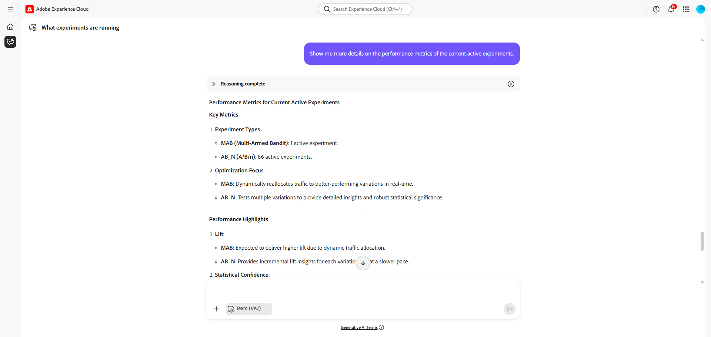

# Experimentation Agent

>[!AVAILABILITY]
>
>Der Experimentation Agent steht allen Kunden zur Verfügung, die die kostenpflichtige Journey Optimizer Experimentation Accelerator-Lizenz erworben haben, und lässt sich nahtlos in Adobe Target oder Adobe Journey Optimizer integrieren.
>
>[Weitere Informationen zu Journey Optimizer Experimentation Accelerator](https://experienceleague.adobe.com/de/docs/experimentation-accelerator/using/overview)

## Überblick

**Experimentation Agent** ist ein KI-gestütztes Tool, das die Ausführung und Verwaltung digitaler Experimente auf Websites, E-Mails, Push-Nachrichten und Anwendungen modernisiert. Die auf der Adobe Experience Platform-KI-Plattform und den Experimentier-Tools aufbauende **Experimentation Agent** hilft Ihnen, Experimente effizienter durchzuführen, Geschäftsziele zu organisieren und umsetzbare Einblicke zu generieren, wobei hervorgehoben wird, was funktioniert hat, was nicht und wo als Nächstes experimentiert werden sollte.

Die folgenden Berechtigungen dienen dazu, die Funktionen von Experimentation Agent vollständig zu nutzen.

* **Experimente anzeigen**: Mit dieser Berechtigung können Sie die Experimentation Agent verwenden, um Einblicke in das Experiment direkt im KI-Assistenten anzuzeigen.

* **Experiment-Metada verwalten**: Mit dieser Berechtigung können Sie die Experimentation Agent verwenden, um neue Experimente direkt im KI-Assistenten zu erstellen.

➡️ [Weitere Informationen finden Sie in der Dokumentation zu Journey Optimizer Experimentation Accelerator](https://experienceleague.adobe.com/de/docs/experimentation-accelerator/using/get-started/experiment-accelerator-access)

Als Teil der Experimentation Accelerator-Funktion bietet der Agent:

* **Leistung**: ein klarer Überblick über die Ereignisse im Experiment

* **Insights**: eine Erklärung, warum die Ergebnisse aufgetreten sind

* **Opportunities**: Anleitung für die nächsten zu ergreifenden Maßnahmen

## Anwendungsfälle

Experimentation Agent verbessert jede Phase des Experimentier-Workflows, indem Ergebnisse analysiert, Inhalte interpretiert und nächste Schritte vorgeschlagen werden.

Seine Funktionen lassen sich in fünf Hauptfunktionen unterteilen:

* **Experimentzusammenfassung**

  Klare, nichttechnische Übersicht über die Experimentergebnisse für Stakeholder

* **Inhaltsanalyse**

  Untersuchen Sie die Messaging- oder kreativen Elemente von Behandlungen, um zu verstehen, warum bestimmte Behandlungen andere übertroffen haben.

* **Attributkennung**

  Kategorisieren Sie Abwandlungen anhand ihrer Schlüsselattribute, z. B. Themen, Töne und Formate, und verbinden Sie diese Attribute mit Konversionsergebnissen.

* **Empfehlungsgenerierung**

  Schlagen Sie neue Behandlungen oder Anpassungen zum Testen vor, die auf Einblicken aus früheren Experimenten basieren.

* **Opportunities**

  Ermitteln Sie weitere Bereiche oder neue Perspektiven für Experimente, um ungenutztes Potenzial zu entdecken.

## Funktionen im Umfang und außerhalb des Umfangs

### **Unterstützte Funktionen**

Die folgenden Funktionen werden derzeit unterstützt:

* Performance
* Insights
* Opportunities

### **Nicht unterstützte Funktionen**

Die folgenden Möglichkeiten werden derzeit nicht unterstützt:

* Erstellen oder Bearbeiten von Experimenten
* Verwenden mehrerer Metriken für Berichte zu Anwendungsfällen

## Eingabeaufforderungen

Im Folgenden finden Sie eine Liste mit Beispielen für Eingabeaufforderungen, die Ihnen bei den ersten Schritten mit Experimentation Agent helfen:

### Allgemeine Fragen

| Eingabeaufforderungen |
|-|
| Welche Experimente werden durchgeführt? |
| Welche Experimente laufen für die `<campaign name>`? |
| Welche Experimente haben im letzten Monat begonnen? |
| Wie viele Experimente sind im letzten Jahr beendet worden? |
| Welche Experimente sind derzeit angehalten/angehalten/etc? |
| Welche allgemeinen Muster ergeben sich aus den jüngsten Tests? |
| Wie lange dauerte ein Experiment im Durchschnitt im letzten Quartal? |

### Leistungsfragen

| Eingabeaufforderungen |
|-|
| Welche Behandlung führt für meine `<experiment name>`? |
| Wie hoch ist der Aufzug des `<experiment name>`? |
| Welche Experimente hatten statistisch signifikante Ergebnisse? |
| Welche Experimente hatten die beste Konversionsrate? |

### Insights-Fragen

| Eingabeaufforderungen |
|-|
| Was ist `<experiment name>`? ? |
| Was haben wir von der `<experiment name>` gelernt? |
| Können Sie mir sagen, warum Behandlung A gewonnen hat? |
| Welche Themen liegen in den erfolgreichsten Varianten im Trend? |
| Welche allgemeinen Muster ergeben sich aus den jüngsten Tests? |
| Ist in `<experiment name>` etwas Unerwartetes passiert? |

### Fragen zu Opportunities

| Eingabeaufforderungen |
|-|
| Was empfehle ich nach diesem Experiment als Nächstes zu tun? |
| Gibt es eine Möglichkeit, die `<experiment name>` zu verbessern? |
| Welche Chancen wurden nach der `<experiment name>` deutlicher? |
| Was könnte ich als Nächstes testen, um die Hypothese von `<experiment name>` zu beweisen? |
| Welche zusätzlichen Anwendungsfälle sollte ich implementieren? |
