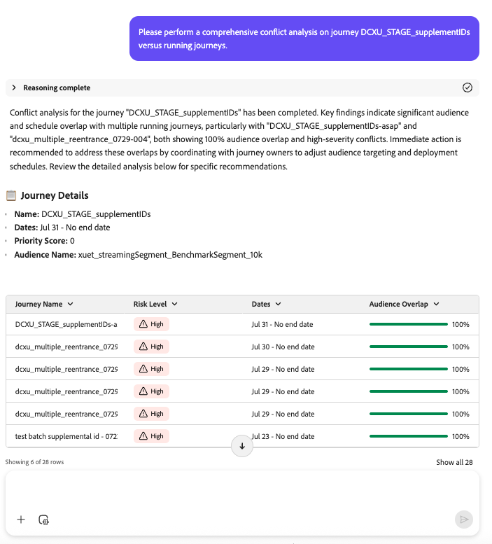

# Journey Analyze Agent: Kompetenzübersicht und Benutzerhandbuch

## Übersicht

Journey Agent ermöglicht es Journey Optimizer-Anwendern, Journey mithilfe einer natürlichen Sprachschnittstelle zu analysieren und zu optimieren. Mit Journey Agent können Anwendende Zeitplankonflikte und/oder Zielgruppenkonflikte schnell identifizieren und lösen, Punkte der Benutzerkündigung in einer Journey erkennen und Einblicke oder Empfehlungen liefern. Es ermöglicht Anwendern, datengesteuerte Entscheidungen zu treffen, die Kundeninteraktion zu verbessern und die Journey-Orchestrierung zu optimieren.

>[!AVAILABILITY]
>
>Die Journey Agent steht allen Kunden zur Verfügung, die Zugriff auf den KI-Assistenten haben. Sie benötigen jedoch die folgenden Berechtigungen, um die Funktionen von Journey Agent vollständig nutzen zu können.
>
>**Journey anzeigen**: Mit dieser Berechtigung können Sie die Journey Agent verwenden, um Einblicke in die Journey direkt im KI-Assistenten anzuzeigen.
>>**Journey verwalten**: Mit der Berechtigung „Bis“ können Sie die Journey Agent verwenden, um neue Journey-Dateien direkt im KI-Assistenten zu erstellen.
>>**Segmente anzeigen**: Mit dieser Berechtigung können Sie die Journey Agent verwenden, um Einblicke in die Zielgruppen direkt im KI-Assistenten anzuzeigen.
>>**Segmente verwalten**: Mit der Berechtigung „Bis“ können Sie die Journey Agent verwenden, um neue Zielgruppen direkt im KI-Assistenten zu erstellen.

## Anwendungsfälle

### Häufige Anwendungsfälle für Journey Agent Analyze

Journey Agent Analyze bietet eine Reihe von Funktionen, mit denen Marketing-Maßnahmen optimiert werden können:

1. **Journey Fallout-Analyse**

   - Stellen Sie fest, wo und warum Kunden während einer Journey abbrechen.
   - Erkennen von Mustern im Kundenverhalten, die zu einer Abmeldung führen.
   - Verwenden Sie Einblicke, um das Journey-Design zu verfeinern und die Kundenbindung zu verbessern.

1. **Journey-Analyse der Zielgruppenüberschneidung**

   - Analyse der Zielgruppenüberschneidung über mehrere Journey hinweg.
   - Vermeiden Sie die Zielgruppenermüdung aufgrund von Über-Targeting.
   - Optimieren Sie die Segmentierung, um eine ausgewogene Interaktion zu gewährleisten.

1. **Journey-Analyse zur Zeitplanüberschneidung**

   - Erkennung von Zeitkonflikten zwischen terminierten Journey, die dieselbe Zielgruppe ansprechen.
   - Vermeiden Sie Überkommunikation und verbessern Sie die Planungseffizienz.
   - Maximieren Sie die Wirkung Ihrer Audience, indem Sie sicherstellen, dass die Journey zu optimalen Zeiten ausgeführt werden.

1. **Operative Einblicke**

   - Prompt-basierte Journey-Einblicke - Erhalten Sie operative Einblicke über Journey, d. h. „Zeige mir alle Live-Journey&quot;.

Bei jeder dieser Analysen erkennt der Agent nicht nur Probleme, sondern gibt auch **umsetzbare Empfehlungen zur Lösung dieser Probleme**.

## In Scope and Out of Scope Skills

### **im Umfang**

Journey Agent Analyze unterstützt die folgenden Funktionen:

- **Reaktive Abfragen**: Ermöglicht es Benutzenden, spezifische Fragen zur Journey-Leistung, Zielgruppennutzung und Zeitplankonflikten zu stellen.
- **Integration mit anderen Agenten**: arbeitet mit Audience Agent und Data Insights Agent für eine genauere Analyse zusammen.
- **Struktur der Agent-**: Argumentation (Erläuterung der Logik), Zusammenfassung der Analyse (Hervorhebung der Schlüsselpunkte), Problemdetails (Beschreibung des Problems) und Empfehlung (Vorschlag der nächsten Schritte).

### **Außerhalb des Bereichs**

Die folgenden Funktionen werden derzeit nicht unterstützt:

- **Automatisierte Journey-Erstellung**
- **Echtzeit-Anomalieerkennung**
- **Überschneidung von Kanälen**
- **Journey-Einstiegsanalyse**
- **Technische Problemanalyse**
- **Ermüdungsanalyse**

## Beispielaufforderungen / Beispielaufforderungen

### Häufige Eingabeaufforderungen für Journey-Analyse

Im Folgenden finden Sie Beispiele für wertvolle Eingabeaufforderungen, mit denen Benutzende ihre Journey untersuchen, überwachen und Fehler beheben können.

### Fragen zum Journey-Lebenszyklus

- „Wann wurde [Journey-Name] veröffentlicht?“
- „Wann wurde [Journey-Name] angehalten?“
- „Alle Journey auflisten, die sich derzeit im Testmodus befinden“

### Journey-Ressourcenfragen

- „Wie viele lebende Journey habe ich?“
- „Geben Sie mir eine Liste aller geplanten wiederkehrenden Journey und ihrer erwarteten Laufzeiten.“

### Zielgruppen- und Journey-Erkenntnisse

- „Welche Zielgruppen werden in mehr als X Journey verwendet?“
- „Listen Sie alle Journey mit der [Zielgruppenname] Zielgruppe auf.“

### Fallout-Analyse

- „Ich möchte den Fallout nach Knoten für das Journey der Kampagne vom 4. Juli analysieren.“
- „Führen Sie eine Fallout-Analyse für das Journey der Kampagne vom 4. Juli durch.“
- „Was bedeutet Profilverlust im Verlauf des Journey der Kampagne vom 4. Juli?“
- „Anzeigen, wo Benutzer in der Journey der Kampagne vom 4. Juli abbrechen.“

### Eingabeaufforderungen zur Konfliktanalyse

Verwenden Sie diese Eingabeaufforderungen, um potenzielle Konflikte zwischen Journeys zu analysieren, einschließlich Zeitplanungs- und Zielgruppenüberschneidungen:

- „Können Sie eine umfassende Konfliktanalyse für unsere Journey [Journey-Name] mit Informationen zum Konflikttyp (Planung/Zielgruppe) mit Live-/laufenden Journey-Dateien durchführen?“
- „Bitte planen Sie eine Konfliktanalyse für Journey [Journey-Name] mit Informationen zum Konflikttyp.“
- „Führen Sie eine Analyse zur Zielgruppenüberschneidung für das Journey von [Journey-] mit Informationen zum Konflikttyp durch.“
- „Gibt es Planungskonflikte für Journey [Journey-Name]?“
- „Konflikte bei Zielgruppenüberschneidungen für Journey [Journey-Name anzeigen]&quot;
- „Analysieren Sie alle Konflikte für das Journey [Journey-Name] mit anderen Live-Journey.“
- „Was sind die aktuellen Konflikte beim Journey [Journey-Name]?“
- „Überprüfen, ob der Journey [Journey-Name] Zielgruppenkonflikte mit anderen Journey aufweist.“
- „Prüfen Sie, ob Planungskonflikte beim Journey [Journey-Name] vorliegen.“
- „Ich möchte mehr über alle Journey-Konflikte für [Journey-Name] erfahren.“
- „Kollidieren Live-Journey mit [Journey-Name] nach Zeitplan oder Zielgruppe?“
- „Identifizieren Sie Konflikttypen für Journey [Journey-Name] im Vergleich zu laufenden Journey.“
- „Überschneidende Zielgruppen für das Journey von [Journey-Name] und anderen Journey anzeigen.“
- „Zeitplanüberschneidungen zwischen Journey [Journey-Name] und Live-Journey hervorheben.“
- „Steht die Ausführung von Journey [Journey]Name} im Konflikt mit einer anderen Journey?“
- „Bitte Konflikte für [Journey-Name} erkennen und ].“
- „Melden Sie alle Konflikttypen für das Journey [Journey-Name].“
- „Geben Sie mir eine Konfliktaufschlüsselung (Planung und Zielgruppe) für [Journey-Name].“
- „Gibt es für [Journey-] Konflikte, die sich auf die Leistung auswirken können?“
- „Gibt es aktive Konflikte, die sich auf [Journey-Name] auswirken?“
- &quot;Journey auflisten, die mit [Journey-Name] in Konflikt stehen, nach Zeitplan oder Zielgruppe.“
- „Hat Journey [Journey-Name] Konflikte ausgelöst?“
- „Finden Sie potenzielle Zielgruppenkonflikte für Journey [Journey-Name].“
- „Analysieren des Konfliktrisikos für Journey [Journey-Name].“
- „Stellen Sie eine Konfliktdiagnose für [Journey-Name] bereit.“

## Best Practices

### Best Practices bei der Eingabeaufforderung

Um die Effektivität von Journey Agent Analyze zu maximieren, befolgen Sie die folgenden Best Practices:

1. **Spezifisch sein**: Verwenden Sie klare und knappe Eingabeaufforderungen, um zielgerichtete Einblicke zu erhalten. Anstatt beispielsweise zu fragen: „Was sind meine Journey?“, geben Sie „Alle im letzten Monat erstellten Journey auflisten“ an.
1. **Einblicke kombinieren**: Integrieren Sie Einblicke aus Audience Agent und Data Insights Agent für eine ganzheitliche Sicht auf die Journey-Leistung.
1. **Iterative Verfeinerung**: Verwenden Sie die Fallout- und Überschneidungsanalyse, um das Journey-Design und die Planung iterativ zu verfeinern.

### Best Practices für die Einrichtung

- **Definieren Sie klare Ziele**: Bevor Sie Journey analysieren, legen Sie klare Ziele fest (z. B. die Verbesserung der Kundenbindung, die Steigerung der Konversionen).
- **Regelmäßig überwachen**: Planen Sie regelmäßige Überprüfungen der Journey-Leistung, um Trends und Anomalien zu identifizieren.
- **Segmentierung optimieren**: Stellen Sie sicher, dass die Zielgruppensegmentierung ausgewogen ist, um Ermüdung zu vermeiden und die Interaktion zu maximieren.