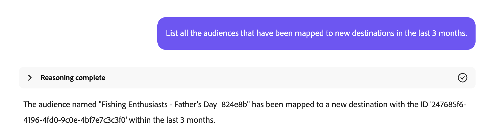

# Audience Agent

>[!AVAILABILITY]
>
>Die Audience Agent steht allen Kunden zur Verfügung, die Zugriff auf den KI-Assistenten haben. Sie benötigen jedoch die folgenden Berechtigungen, um die Funktionen von Audience Agent vollständig nutzen zu können.
>
>**Segmente anzeigen**: Mit dieser Berechtigung können Sie die Audience Agent verwenden, um Einblicke in die Zielgruppen direkt im KI-Assistenten anzuzeigen.
>
>**Segmente verwalten**: Mit der Berechtigung „Bis“ können Sie die Audience Agent verwenden, um neue Zielgruppen direkt im KI-Assistenten zu erstellen.

Mit der Audience Agent können Sie Einblicke zu Zielgruppen erhalten, einschließlich der Erkennung signifikanter Änderungen der Zielgruppengröße, der Erkennung doppelter Zielgruppen, der Untersuchung Ihres Zielgruppeninventars und des Abrufs der Zielgruppengröße.

>[!SLIDE](audience-agent-overview)

## Unterstützte Anwendungsfälle

Der Audience Agent innerhalb des KI-Assistenten unterstützt die folgenden Anwendungsfälle:

- Unterhalten Sie Ihre Zielgruppe
   - Suchen nach Zielgruppengrößen vorhandener Zielgruppen
   - Auf der Grundlage vollständiger oder teilweiser Attribute mit den folgenden Namen nach Zielgruppen suchen
   - Erkennen doppelter Zielgruppen
   - Entdecken Sie XDM-Felder, mit denen Sie eine Zielgruppe definieren können
- Erkennung signifikanter Änderungen der Zielgruppengröße
   - Auf diese Weise können Sie Zielgruppen finden, die plötzlich gewachsen oder geschrumpft sind, sodass Sie potenzielle Marktveränderungen besser analysieren können
- Erstellung einer Zielgruppe
   - Mit dieser Fähigkeit können Sie eine Zielgruppe basierend auf den angegebenen Attributen und Ereignissen erstellen
   - Darüber hinaus können Sie mit dieser Fähigkeit die potenzielle Größe einer Zielgruppe schätzen, bevor Sie die Zielgruppe erstellen, sodass Sie schnell die effektivste Zielgruppe durchlaufen können, bevor sie aktiviert werden kann

<!-- - Find your audience size and detect significant changes in audience size
  - This lets you find audiences that have suddenly grown or shrunk, letting you better analyze potential market changes
- Detect duplicate audiences
  - This lets you reduce redundancies with your created audiences
- Find audiences based on full or partial attributes named
  - This lets you more easily navigate through your audience inventory
- Discover XDM fields you can use to define an audience
  - This skill lets you more easily identify the right fields to use in your audience based on context and relevance -->

Die Audience Agent unterstützt **derzeit** folgende Funktion nicht:

- Zielbasierte Zielgruppenexploration
   - Durch die zielbasierte Audience-Exploration können Sie relevante Datensätze und Profile ermitteln, die auf ein Geschäftsziel ausgerichtet sind, indem Sie maschinelle Lernmodelle wie Kaufneigung oder Konversionsneigung anwenden.

Darüber hinaus sollten Sie bei der Verwendung von Audience Agent die folgenden Einschränkungen beachten:

- Audience Agent benötigt mindestens 24 Stunden zur Verarbeitung Ihrer Daten
   - Sie können beispielsweise **nicht** eine Abfrage haben, die innerhalb der letzten 24 Stunden nach Daten sucht. Sie müssen mindestens innerhalb der letzten 48 Stunden nachsehen.
- Audience Agent unterstützt nur die folgenden Zielgruppentypen:
   - **Benutzerbasierte** Zielgruppen, die mithilfe der Batch-Segmentierung ausgewertet werden
   - **Account-basierte** Zielgruppen für die folgenden Anwendungsfälle:
      - Konversative Zielgruppenforschung
      - Erkennung doppelter Zielgruppen

## Eingabeaufforderungen im Beispiel

Die folgenden Beispiele zeigen Beispielaufforderungen und -antworten für die Audience Agent.

### Konversative Zielgruppenforschung

Felder für wohlhabende Käufer anzeigen.

+++ Antwort


+++

Welche Zielgruppen wurden in den letzten 30 Tagen in keiner Kampagne aktiviert oder verwendet?

+++ Antwort


+++

Listet alle Zielgruppen auf, die in den letzten 3 Monaten neuen Zielen zugeordnet wurden.

+++ Antwort



+++

Welche Konto-Zielgruppe hat die größte Zielgruppengröße und wie groß ist diese?

+++ Antwort


+++

### Erkennen doppelter Zielgruppen

Habe ich Zielgruppen mit identischen oder ähnlichen Beschreibungen?

+++ Antwort


+++

Identifizieren Sie Zielgruppen, die dieselben Regeln, aber unterschiedliche Namen haben.

+++ Antwort


+++

Anzeigen aller Zielgruppen mit denselben Regeln, aber unterschiedlichen Aktivierungszielen.

+++ Antwort


+++

Identifizieren Sie Konto-Zielgruppen, die dieselben Regeln, aber unterschiedliche Namen haben.

+++ Antwort


+++

### Abrufen der Zielgruppengröße

Wie groß ist meine Audience „Gold-Star Members in California_f153e1“ aktuell?

+++ Antwort


+++

Welches ist mein größtes Publikum?

+++ Antwort


+++

### Erkennung signifikanter Änderungen der Zielgruppengröße

Welche Zielgruppen haben in der letzten Woche um mehr als 20 % zugenommen?

+++ Antwort


+++

Welche Zielgruppen sind im letzten Monat um mehr als 10 % kleiner geworden?

+++ Antwort


+++

Welches ist mein am schnellsten wachsendes Publikum?

+++ Antwort


+++

### Erstellen einer Zielgruppe

Wenn Sie mit Audience Agent eine Zielgruppe erstellen, führt Sie der KI-Assistent durch einen Plan. Sie können beispielsweise anfordern, „eine Zielgruppe aus Personen zu erstellen, die in Kalifornien leben“. Der KI-Assistent listet dann den Plan auf, den er zur Erstellung der Zielgruppe durchführen wird.

+++ Antwort


+++

Dieser Plan umfasst drei Schritte:

1. [Identifizieren von Zielgruppeneigenschaften](#identify)
2. [Zielgruppengröße schätzen](#estimate)
3. [Erstellen und Beibehalten einer neuen Zielgruppe](#create)

#### Identifizieren von Zielgruppeneigenschaften {#identify}

{align="center" width="80%"}

Nachdem Sie den Plan akzeptiert haben, erfasst der KI-Assistent die Eigenschaften der Zielgruppe basierend auf Ihrer ersten Abfrage.

+++ Antwort


Für diese Abfrage generiert der KI-Assistent den entsprechenden Profile Query Language (PQL), der nach Personen sucht, die in Kalifornien leben. In diesem Anwendungsfall würde die PQL-Abfrage wie folgt aussehen:

```sql
homeAddress.state.equals("California", false)
```

Weiterführende Informationen zu PQL finden Sie in der Übersicht zu [PQL](https://experienceleague.adobe.com/en/docs/experience-platform/segmentation/pql/overview).

+++

Wenn die Zielgruppendefinition des KI-Assistenten korrekt ist, können Sie sie genehmigen und mit dem nächsten Schritt fortfahren.

#### Zielgruppengröße schätzen {#estimate}

{align="center" width="80%"}

Nach Genehmigung der identifizierten Zielgruppeneigenschaften schätzt der KI-Assistent die Größe der potenziellen Zielgruppe und die Details der Zielgruppendefinition.

+++ Antwort


+++

Wenn die geschätzte Größe korrekt aussieht, können Sie sie genehmigen und mit dem nächsten Schritt fortfahren.

#### Neue Zielgruppe erstellen und beibehalten {#create}

{align="center" width="80%"}

Wenn die Eigenschaften und die Zielgruppengröße korrekt aussehen, können Sie die Erstellung der Zielgruppe genehmigen oder ablehnen.

+++ Antwort

Zunächst können Sie die vorgeschlagene Zielgruppe über das bereitgestellte Datenraster überprüfen.


Wenn die Zielgruppe korrekt dargestellt wird, können Sie den Vorschlag akzeptieren, indem Sie auf **[!UICONTROL Erstellen]** klicken, um die Erstellung der Zielgruppe abzuschließen.


+++

Die Zielgruppe wird jetzt erstellt.

{align="center" width="80%"}

## Nächste Schritte

Nach dem Lesen dieses Handbuchs sollten Sie ein besseres Verständnis von Audience Agent und den unterstützten Funktionen haben. Weitere Informationen zu Agenten in Adobe Experience Platform finden Sie in der [Übersicht über Agent Orchestrator](./agent-orchestrator.md).

