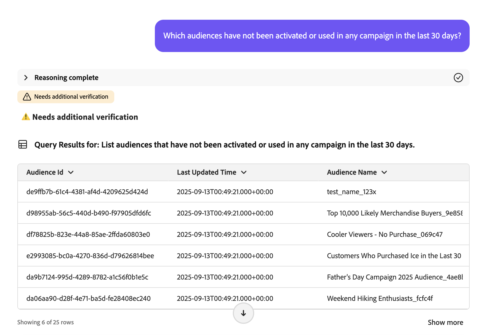

# Audience Agent

>[!AVAILABILITY]
>
>Die Audience Agent steht allen Kunden zur Verfügung, die Zugriff auf den KI-Assistenten haben. Sie benötigen jedoch die folgenden Berechtigungen, um die Funktionen von Audience Agent vollständig nutzen zu können.
>
>**Segmente anzeigen**: Mit dieser Berechtigung können Sie die Audience Agent verwenden, um Einblicke in die Zielgruppen direkt im KI-Assistenten anzuzeigen.
>
>**Segmente verwalten**: Mit der Berechtigung „Bis“ können Sie die Audience Agent verwenden, um neue Zielgruppen direkt im KI-Assistenten zu erstellen.

Mit der Audience Agent können Sie Einblicke zu Zielgruppen erhalten, einschließlich der Erkennung signifikanter Änderungen der Zielgruppengröße, der Erkennung doppelter Zielgruppen, der Untersuchung Ihres Zielgruppeninventars und des Abrufs der Zielgruppengröße.

## Unterstützte Anwendungsfälle

Der Audience Agent innerhalb des KI-Assistenten unterstützt die folgenden Anwendungsfälle:

- Ermitteln Sie die Größe Ihrer Audience und erkennen Sie signifikante Änderungen der Audience-Größe

   - Auf diese Weise können Sie Zielgruppen finden, die plötzlich gewachsen oder geschrumpft sind, sodass Sie potenzielle Marktveränderungen besser analysieren können

- Erkennen doppelter Zielgruppen

   - Auf diese Weise können Sie Redundanzen mit den erstellten Zielgruppen reduzieren

- Zielgruppen basierend auf vollständigen oder partiellen Attributen mit dem Namen suchen

   - Auf diese Weise können Sie einfacher durch Ihren Zielgruppenbestand navigieren

- Entdecken Sie XDM-Felder, mit denen Sie eine Zielgruppe definieren können

   - Mit dieser Fähigkeit können Sie basierend auf Kontext und Relevanz die richtigen Felder für Ihre Zielgruppe leichter identifizieren

Die Audience Agent unterstützt **derzeit** die folgenden Funktionen nicht:

- Wissensbasierte Zielgruppenerstellung

   - Die wissensbasierte Zielgruppenerstellung erstellt eine Zielgruppe basierend auf den angegebenen Attributen und Ereignissen
   - Darüber hinaus können Sie die potenzielle Größe der Zielgruppe vor der Erstellung der Zielgruppe schätzen. Auf diese Weise können Sie die effektivste Zielgruppe schnell durchlaufen, bevor sie aktiviert werden kann
   - Die Unterstützung für diese Funktion wird in Kürze verfügbar sein

- Zielbasierte Zielgruppenexploration

   - Durch die zielbasierte Audience-Exploration können Sie relevante Datensätze und Profile ermitteln, die auf ein Geschäftsziel ausgerichtet sind, indem Sie maschinelle Lernmodelle wie Kaufneigung oder Konversionsneigung anwenden.

Darüber hinaus sollten Sie bei der Verwendung von Audience Agent die folgenden Einschränkungen beachten:

- Audience Agent benötigt mindestens 24 Stunden zur Verarbeitung Ihrer Daten

   - Sie können beispielsweise **nicht** eine Abfrage haben, die innerhalb der letzten 24 Stunden nach Daten sucht. Sie müssen mindestens innerhalb der letzten 48 Stunden nachsehen.

- Audience Agent unterstützt nur **(Personen**-basierte Zielgruppen, die mithilfe der Batch-Segmentierung ausgewertet werden

## Eingabeaufforderungen im Beispiel

Die folgenden Beispiele zeigen Beispielaufforderungen und -antworten für die Audience Agent.

### Konversation zur Untersuchung von Zielgruppen

Felder für wohlhabende Käufer anzeigen.

+++ Antwort

+++

Welche Zielgruppen wurden in den letzten 30 Tagen in keiner Kampagne aktiviert oder verwendet?

+++ Antwort

+++

Listet alle Zielgruppen auf, die in den letzten 3 Monaten neuen Zielen zugeordnet wurden.

+++ Antwort

+++

### Erkennen doppelter Zielgruppen

Habe ich Zielgruppen mit identischen oder ähnlichen Beschreibungen?

+++ Antwort

+++

Identifizieren Sie Zielgruppen, die dieselben Regeln, aber unterschiedliche Namen haben.

+++ Antwort

+++

Anzeigen aller Zielgruppen mit denselben Regeln, aber unterschiedlichen Aktivierungszielen.

+++ Antwort

+++

### Abrufen der Zielgruppengröße

Wie groß ist meine Audience „Gold-Star Members in California_f153e1“ aktuell?

+++ Antwort

+++

Welches ist mein größtes Publikum?

+++ Antwort

+++

### Erkennung signifikanter Änderungen der Zielgruppengröße

Welche Zielgruppen haben in der letzten Woche um mehr als 20 % zugenommen?

+++ Antwort

+++

Welche Zielgruppen sind im letzten Monat um mehr als 10 % kleiner geworden?

+++ Antwort

+++

Welches ist mein am schnellsten wachsendes Publikum?

+++ Antwort

+++

## Nächste Schritte

Nach dem Lesen dieses Handbuchs sollten Sie ein besseres Verständnis von Audience Agent und den unterstützten Funktionen haben. Weitere Informationen zu Agenten in Adobe Experience Platform finden Sie in der [Übersicht über Agent Orchestrator](./agent-orchestrator.md).

