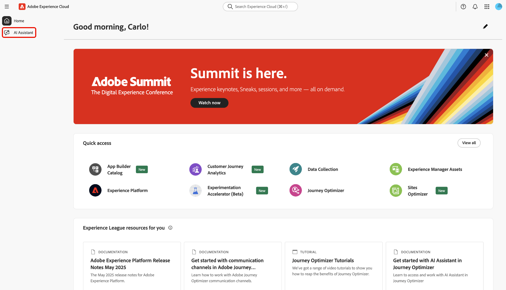
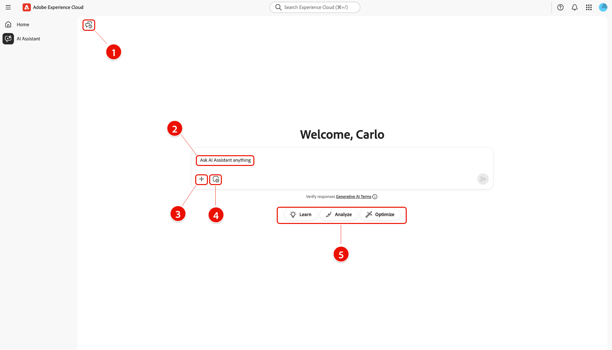
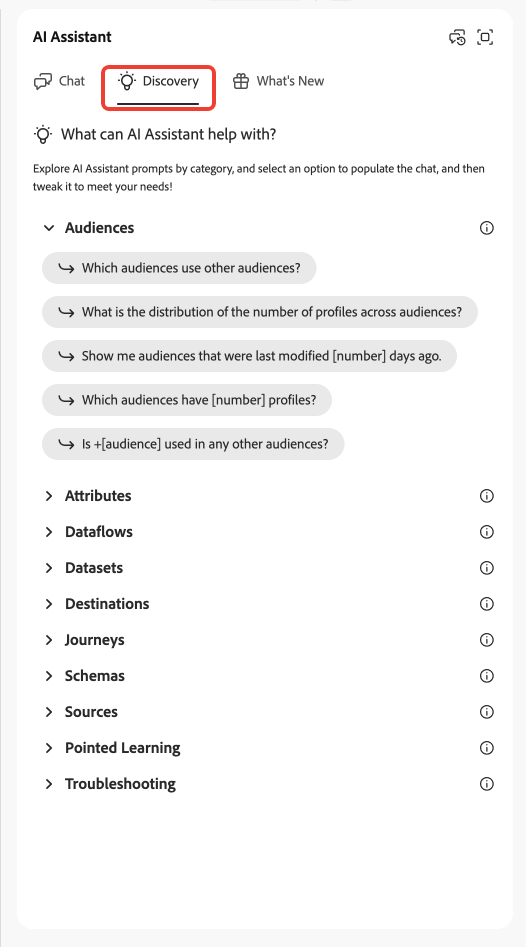
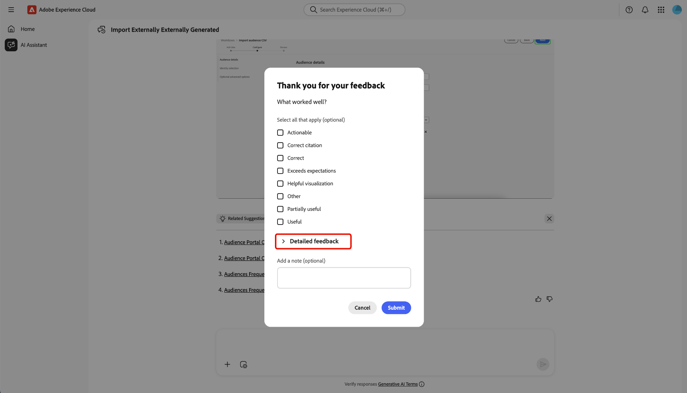
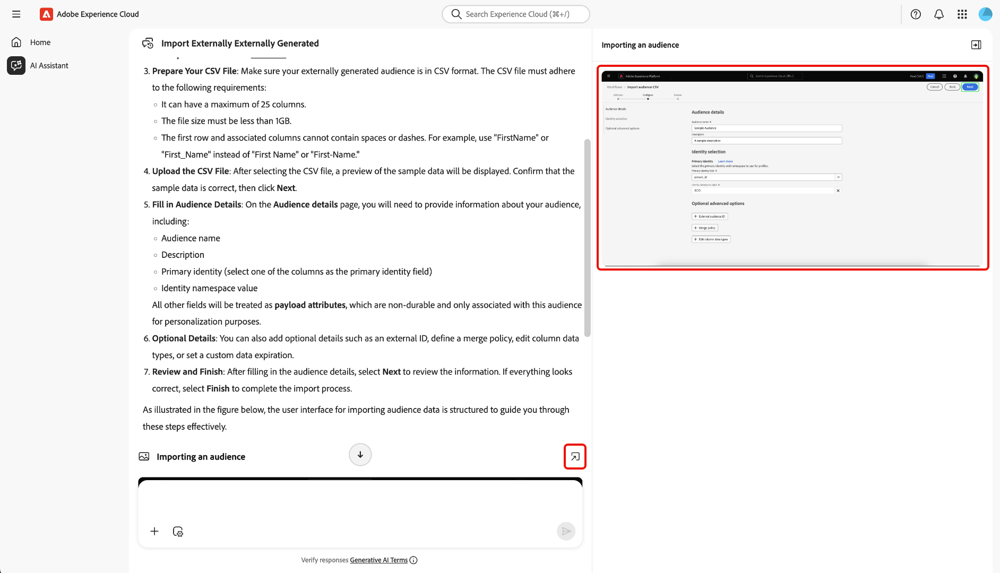
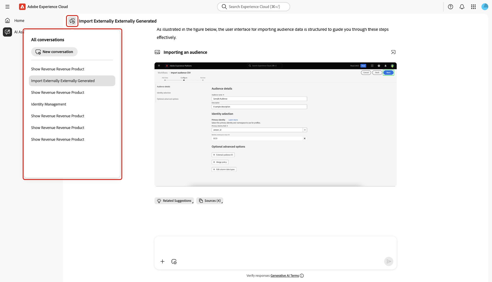
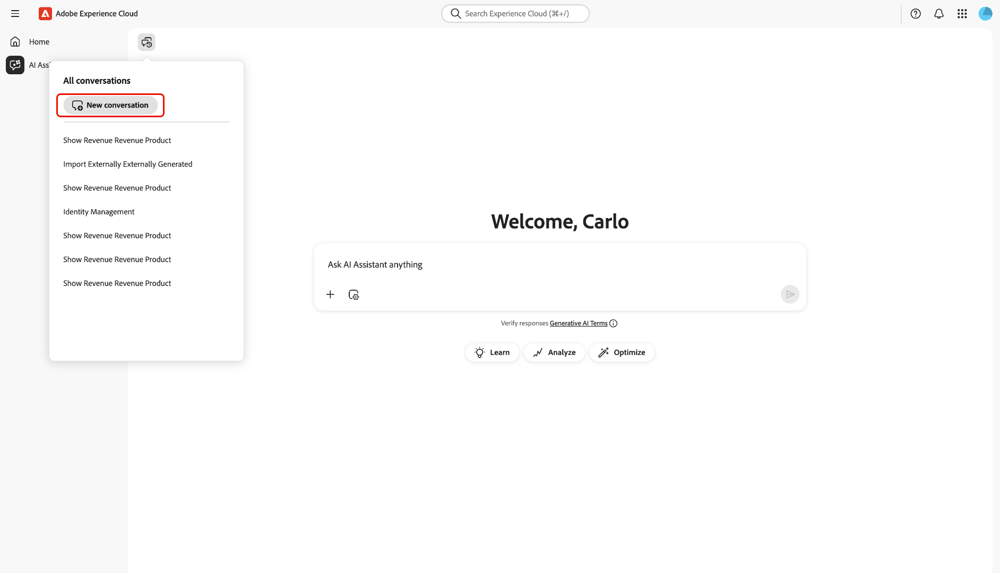
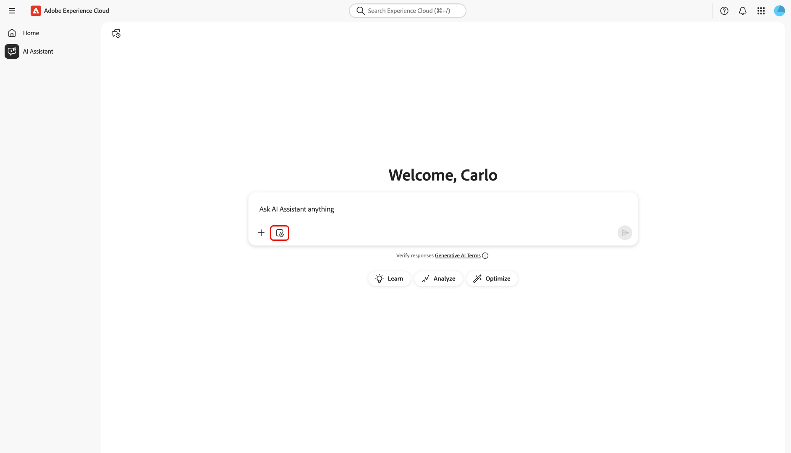
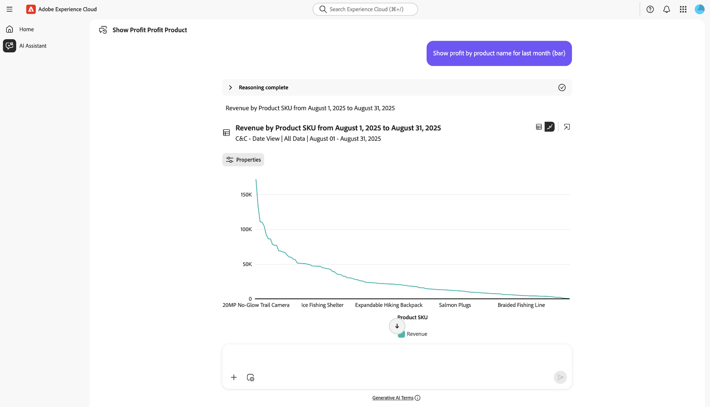

# KI-Assistent

>[!IMPORTANT]
>
>Dieses Dokument gilt für KI-Assistenten (der nächsten Generation). Informationen zum KI-Assistenten (veraltet) finden Sie im [Handbuch zur Benutzeroberfläche des KI-Assistenten](https://experienceleague.adobe.com/de/docs/experience-platform/ai-assistant/home) in der Dokumentation zu Adobe Experience Platform.

In der folgenden Tabelle finden Sie einen Vergleich von KI-Assistent (veraltet) und KI-Assistent (nächste Generation):

| Merkmalsbereich | KI-Assistent (veraltet) | KI-Assistent (nächste Generation) |
| --- | --- | --- |
| Benutzererlebnis | Der KI-Assistent (veraltet) ist nur in einem Bereich der rechten Leiste verfügbar. | Der KI-Assistent (der nächsten Generation) ist sowohl im Bereich der rechten Leiste als auch im immersiven Vollbilderlebnis verfügbar. |
| Funktionsumfang | Sie können den KI-Assistenten (frühere Version) sowohl für Produktkenntnisse als auch für betriebliche Einblicke verwenden. | Sie können den KI-Assistenten (der nächsten Generation) für Produktkenntnisse, operative Einblicke sowie erweiterte agentische Fähigkeiten und die Ausführung mehrstufiger Aufgaben verwenden. |
| Architektur von Platform | Der KI-Assistent (veraltet) wurde nicht auf dem Agent Orchestrator-Stack erstellt. | Der KI-Assistent (der nächsten Generation) wird von [Adobe Experience Platform Agent Orchestrator &#x200B;](https://experienceleague.adobe.com/de/docs/experience-cloud-ai/experience-cloud-ai/agents/agent-orchestrator) unterstützt und ermöglicht Erweiterbarkeit und erweiterte Koordinierung über Funktionen hinweg. |
| Anwendungsbereich | Der KI-Assistent (veraltet) ist eine anwendungsspezifische Implementierung. | Sie können den KI-Assistenten (der nächsten Generation) für ein einheitliches KI-Assistentenerlebnis in allen Adobe Experience Cloud-Programmen verwenden. |
| Zugriffs- und Berechtigungsmodell | Auf einzelne Produktgrenzen abgestimmtes Zugriffsmodell für die Anwendung. | Alle Benutzer erhalten Zugriff auf den KI-Assistenten (der nächsten Generation) und die zugehörigen Experience Platform-Agenten. **Hinweis**: <ul><li>**Adobe Experience Manager**: Ihr Administrator muss Ihnen über die [Adobe Admin Console](https://helpx.adobe.com/de/enterprise/using/admin-console.html) die Berechtigung für den Zugriff auf den KI-Assistenten (der nächsten Generation) erteilen.</li><li>**Customer Journey Analytics**: Ihr Administrator muss Ihnen die Berechtigung für den Zugriff auf den KI-Assistenten über die [Customer Journey Analytics-Zugriffssteuerung](https://experienceleague.adobe.com/en/docs/analytics-platform/using/technotes/access-control?lang=en) erteilen. Auf diese Weise können Sie Fragen zu Produktwissen und Dateneinblicken stellen. |

AI Assistant ist ein interaktives, generatives KI-Tool, das die Produktivität steigert und die Arbeit in Adobe Experience Platform-basierten Anwendungen neu definiert. Sie können den KI-Assistenten verwenden, um auf Adobe Experience Platform-Agenten und andere KI-Funktionen zuzugreifen.

Lesen Sie dieses Handbuch, um zu erfahren, wie Sie den KI-Assistenten verwenden können.

>[!SLIDE](agent-orchestrator-ui)

## Zugriff auf den KI-Assistenten

Es gibt mehrere Möglichkeiten, auf den KI-Assistenten zuzugreifen.

Wählen Sie auf der Experience Cloud-Startseite **[!UICONTROL KI-Assistent]** aus der linken Navigationsleiste, um die Vollbildansicht des KI-Assistenten zu öffnen.

+++Zum Anzeigen auswählen

+++

Sie können den KI-Assistenten auch über die Startseiten von Experience Cloud-Programmen wie Experience Platform, Adobe Journey Optimizer und Customer Journey Analytics starten. Navigieren Sie zu Ihrer Produkt-Startseite und wählen Sie dann in der oberen **das Symbol** KI-Assistent“ aus, um das Chat-Bedienfeld des KI-Assistenten in der rechten Leiste zu starten.

+++Zum Anzeigen auswählen

+++

## Navigieren in der Benutzeroberfläche des KI-Assistenten

In diesem Abschnitt erfahren Sie, wie Sie in der Benutzeroberfläche des KI-Assistenten navigieren können.

### Vollbildansicht

Die Benutzeroberfläche des KI-Assistenten umfasst mehrere wichtige Elemente, die Ihnen bei der effektiven Interaktion helfen:

1. **[!UICONTROL Unterhaltungen]**: Wählen Sie das Symbol **[!UICONTROL Unterhaltungen]** aus, um eine neue Unterhaltung zu beginnen und auf aktuelle Unterhaltungen aus Ihrem Verlauf zuzugreifen. Weitere Informationen finden Sie im Abschnitt zu [Konversationen](#conversations).
2. **Eingabefeld**: Wählen Sie das Eingabefeld aus, um Fragen und Eingabeaufforderungen für den KI-Assistenten einzugeben. Weitere Informationen finden Sie im Abschnitt zu [Eingabefunktionen](#input-features).
3. **Daten und Objekt automatisch vervollständigen**: - Wählen Sie das Pluszeichen, um Daten- und Objektvorschläge zu verwenden und die automatische Vervollständigung durchzuführen. Wenn ausgewählt, können Sie ein Popup-Fenster verwenden, um vorgeschlagene Entitäten auszuwählen. Weitere Informationen finden Sie im Abschnitt zu [automatische Vervollständigung von Daten und Objekten](#autocomplete).
4. **Kontexteinstellung**: Wählen Sie das Symbol Kontexteinstellung aus, um Informationsquellen für den KI-Assistenten zu konfigurieren. Sie können dieses Tool verwenden, um die Anwendung, Sandbox und Datenansicht zu konfigurieren, auf die der KI-Assistent verweist, um Ihre Abfrage zu beantworten. Weitere Informationen finden Sie im Abschnitt zu [Kontexteinstellungen](#context-setting).
5. **Discovery**: Wählen Sie **[!UICONTROL Lernen]**, **[!UICONTROL Analysieren]** und **[!UICONTROL Optimieren]**, um Beispielabfragen anzuzeigen, mit denen Sie beginnen können. Weitere Informationen finden Sie im Abschnitt zu [Entdeckungsaufforderungen](#discoverability-prompts).

### Leistenansicht

Die Leistenansicht bietet schnellen Zugriff auf Chat, Erkennungsaufforderungen, Aktualisierungen, Unterhaltungen und Benutzeroberflächen-Steuerelemente in einem kompakten Bedienfeld.

1. **[!UICONTROL Chat]**: Wählen Sie **[!UICONTROL Chat]** in der Kopfzeile aus, um zu Ihrer Konversation zurückzukehren, falls Sie sie verlassen haben, um auf verschiedene Elemente in der Benutzeroberfläche zuzugreifen.
1. **[!UICONTROL Discovery]**: Wählen Sie **[!UICONTROL Discovery]** aus, um eine Liste der Eingabeaufforderungen des KI-Assistenten nach Kategorie geordnet anzuzeigen. Sie können diese vorkonfigurierten Eingabeaufforderungen verwenden, um Ihren Chat zu füllen. Darüber hinaus können Sie die vorgeschlagenen Eingabeaufforderungen an Ihren jeweiligen Anwendungsfall anpassen.
1. **[!UICONTROL Neue Funktionen]** Wählen Sie **[!UICONTROL Neue Funktionen]** aus, um eine Liste der neuesten Aktualisierungen anzuzeigen, die für den KI-Assistenten verfügbar sind.
1. **[!UICONTROL Unterhaltungen]**: Wählen Sie das Symbol **[!UICONTROL Unterhaltungen]** aus, um eine neue Unterhaltung zu beginnen und auf aktuelle Unterhaltungen aus Ihrem Verlauf zuzugreifen. Weitere Informationen finden Sie im Abschnitt zu [Konversationen](#conversations).
1. **Vollbildansicht**: Wählen Sie das Symbol **[!UICONTROL Vollbildansicht]** aus, um Ihre Benutzeroberfläche des KI-Assistenten von der rechten Leiste in den Vollbildmodus zu ändern.
1. **Automatische Vervollständigung von Daten und Objekten**: Wählen Sie das Pluszeichen, um Daten- und Objektvorschläge zu verwenden und die automatische Vervollständigung durchzuführen. Wenn ausgewählt, können Sie ein Popup-Fenster verwenden, um vorgeschlagene Entitäten auszuwählen. Weitere Informationen finden Sie im Abschnitt zu [automatische Vervollständigung von Daten und Objekten](#autocomplete).
1. **Kontexteinstellung**: Wählen Sie das Symbol Kontexteinstellung aus, um Informationsquellen für den KI-Assistenten zu konfigurieren. Sie können dieses Tool verwenden, um die Anwendung, Sandbox und Datenansicht zu konfigurieren, auf die der KI-Assistent verweist, um Ihre Abfrage zu beantworten. Weitere Informationen finden Sie im Abschnitt zu [Kontexteinstellungen](#context-setting).

## Handbuch zur Benutzeroberfläche des KI-Assistenten

Dieser Abschnitt bietet einen Überblick über die wichtigsten Funktionen und Navigationsoptionen in der Benutzeroberfläche des KI-Assistenten. Es wird erläutert, wie auf den KI-Assistenten zugegriffen wird, das Layout und die Steuerelemente sowohl in der Vollbild- als auch in der Leistenansicht beschrieben werden und es werden wichtige Tools wie Unterhaltungen, Eingabefunktionen, automatische Vervollständigung, Kontexteinstellungen und Erkennungsaufforderungen vorgestellt. Die folgenden Abschnitte enthalten detaillierte Anleitungen zur Verwendung dieser Funktionen, um mit dem KI-Assistenten zu interagieren und Ihre Erfahrung optimal zu nutzen.

### Erkennungsaufforderungen {#discovery-prompts}

You can use AI Assistant&#39;s discovery feature to view a list of the general subjects, grouped into entities, that AI Assistant supports. Discovery prompts are different depending on your starting point.

>[!BEGINTABS]

>[!TAB Use discovery from the full screen view]

From the full screen view, discovery prompts are grouped into three categories: **[!UICONTROL Learn]**, **[!UICONTROL Analyze]**, and **[!UICONTROL Optimize]**.

To use discovery prompts to advance product knowledge, select **[!UICONTROL Learn]** and then select a prompt from the dropdown window that appears.

>[!TAB Use discover from the rail view]

Select **[!UICONTROL Discovery]** from the rail view to access an extensive list of discovery prompts that you can use to get started and populate your chat with AI Assistant.

>[!ENDTABS]

Select a prompt to populate the input box. From here, you can edit the prompt to fit your particular use case. When ready, select the send icon on the right to submit your query.

## Interacting with responses

### Check for reasoning process {#reasoning}

AI Assistant then queries its knowledge base and computes an answer. After a few moments, AI Assistant returns an answer, including options to dive deeper into its reasoning process, related suggestions, information sources, and feedback tools.

To better understand the underlying reasoning process, select **[!UICONTROL Reasoning complete]**.

The *[!UICONTROL Reasoning complete]* window expands to display a summary of your request and details on how the response was crafted.

### Use related suggestions

Next, navigate down to the bottom of the response and select **[!UICONTROL Related suggestions]** to receive a list of prompts relating to your initial query. You can use these prompts to further continue your conversation with AI Assistant.

### Quellen anzeigen

Um die Antwort des KI-Assistenten zu überprüfen, wählen Sie **[!UICONTROL Quellen]** aus, um eine Liste der Informationsquellen anzuzeigen, auf die der KI-Assistent bei der Berechnung seiner Antwort verwiesen hat.

### Feedback geben

Mithilfe der mit der Antwort bereitgestellten Optionen können Sie Feedback zu Ihren Erfahrungen mit dem KI-Assistenten geben.

Um Feedback zu geben, wählen Sie entweder Daumen hoch oder Daumen runter aus, nachdem Sie eine Antwort vom KI-Assistenten erhalten haben, und geben Sie dann Ihr Feedback in das bereitgestellte Textfeld ein.

>[!BEGINTABS]

>[!TAB Daumen hoch]

Wählen Sie **[!UICONTROL Daumen hoch]**, um positives Feedback zu geben. Sie können optional aus einer Liste mit positivem Feedback auswählen oder das Eingabefeld verwenden, um Ihr eigenes spezifisches Feedback einzugeben.

+++Zum Anzeigen auswählen

Sie können auch **[!UICONTROL Detailliertes Feedback]** auswählen, um Ihr Feedback weiter auszuarbeiten. Wenn Sie fertig sind, klicken Sie auf **[!UICONTROL Absenden]**..

+++

>[!TAB Daumen runter]

Wählen Sie **[!UICONTROL Daumen runter]** um konstruktives Feedback zu geben. Sie können optional aus einer Liste mit konstruktivem Feedback auswählen oder das Eingabefeld verwenden, um Ihr eigenes spezifisches Feedback einzugeben.

+++Zum Anzeigen auswählen

Ebenso können Sie auch **[!UICONTROL Detailliertes Feedback]** auswählen, um Ihr Feedback weiter auszuarbeiten. Wenn Sie fertig sind, klicken Sie auf **[!UICONTROL Absenden]**..

+++

>[!ENDTABS]

### Verwenden der Funktion „Aufspaltungsansicht“

Wenn die Antwort des KI-Assistenten ein Bild enthält, können Sie das Pfadsymbol auswählen, um einen Aufspaltungsmodus zu starten. Auf diese Weise können Sie die gesamte Antwort des KI-Assistenten mit dem kontextuellen Bild, das auf der rechten Seite angezeigt wird, lesen.

### Unterhaltungen

Sie können das Bedienfeld *[!UICONTROL Alle Konversationen]* verwenden, um Konversationen mit dem KI-Assistenten zurückzusetzen und erneut aufzurufen. Wählen Sie das Symbol **[!UICONTROL Konversationen]** aus, um das Fenster *[!UICONTROL Alle Konversationen]* anzuzeigen.

To revisit a previous conversation, select the conversation topic from the list provided.

To start a new conversation, select **[!UICONTROL New conversation]**.

### Context setting {#context-setting}

Use the context setting feature of AI Assistant to configure the **application**, **sandbox**, and **dataview** that AI Assistant references to answer your query. To access context setting, select the **[!UICONTROL Context setting]** icon from the input box.

The *[!UICONTROL Answer from...]* pop-up window appears. Use this window to configure the information sources that you want to use and then select **[!UICONTROL Set context]**.

| Information source | Beschreibung | Beispiele |
| --- | --- | --- |
| App | The Experience Cloud application that your query pertains to. | Experience Platform, Journey Optimizer, Customer Journey Analytics, etc. |
| Sandbox | The sandbox that contains the dataset(s) or information that your query pertains to. | Prod (VA7), Dev. |
| Dataview | When you&#39;re using AI Assistant with Customer Journey Analytics, the dataview setting helps the Data Insights Agent understand: <ul><li>Which datasets to query</li><li>What data components are available</li><li>How to structure responses about your data</li><li>Which visualizations to create in Analysis Workspace</li></ul> | |

### Data and object autocomplete

You can use the autocomplete function to receive a list of data objects that exist in your sandbox. Um die automatische Vervollständigung zu verwenden, geben Sie in Ihrer Abfrage das Pluszeichen (+) ein. Alternativ können Sie auch das Pluszeichen (+) unten im Texteingabefeld auswählen. Es wird ein Fenster mit einer Liste empfohlener Datenobjekte aus Ihrer Sandbox angezeigt.

### Überprüfen von Antworten

Es gibt eine Reihe von Möglichkeiten, Antworten des KI-Assistenten zu überprüfen. Wählen Sie **[!UICONTROL Abfragebegriff, der mit Objekten]** wurde) aus, um eine Zusammenfassung der Begriffe in Ihrer Abfrage anzuzeigen, die mit bestimmten Objekten in Ihrer Organisation abgeglichen wurden.

Wählen Sie **[!UICONTROL Hier habe ich die Ergebnisse erhalten]** um eine detaillierte, schrittweise Erklärung zu erhalten, wie der KI-Assistent zu seiner Antwort gelangt ist. Darüber hinaus können Sie auch die SQL-Abfrage anzeigen, die zur Beantwortung Ihrer Frage ausgeführt wurde. Diese Abfrage ist schreibgeschützt und wird für die Verwendung im Abfrage-Service nicht unterstützt.

### Konfigurieren der Datenvisualisierung

Sie können die Datenvisualisierungsfunktionen des KI-Assistenten verwenden, um Ihre Daten besser zu verstehen. Sie können auch den Diagrammtyp angeben, den Sie in Ihrer Abfrage verwenden möchten. Senden Sie beispielsweise eine Abfrage mit folgendem Inhalt: **Nach Produktname für letzten Monat (Balken) Gewinn anzeigen“**, um ein Balkendiagramm für den Gewinn im letzten Monat zu erhalten, sortiert nach Produktname.

Wählen Sie anschließend **[!UICONTROL Eigenschaften]**, um den Diagrammtyp zu ändern und Werte für Ihre X- und Y-Achse zu konfigurieren.

Der KI-Assistent unterstützt verschiedene Diagrammtypen für die Datenvisualisierung. Sie können mit allen Diagrammtypen interagieren, indem Sie den Mauszeiger über die Daten bewegen.

>[!BEGINTABS]

>[!TAB Line]

Um ein Liniendiagramm anzuzeigen, wählen Sie **[!UICONTROL Eigenschaften]** und anschließend **[!UICONTROL Linie]** aus.

>[!TAB Bereich]

Um ein Flächendiagramm anzuzeigen, wählen Sie **[!UICONTROL Eigenschaften]** und dann **[!UICONTROL Bereich]** aus.

>[!TAB Streuung]

Um ein Streudiagramm anzuzeigen, wählen Sie **[!UICONTROL Eigenschaften]** und dann **[!UICONTROL Streudiagramm]** aus.

>[!TAB Ringdiagramm]

Um ein Ringdiagramm anzuzeigen, wählen Sie **[!UICONTROL Eigenschaften]** und dann **[!UICONTROL Ringdiagramm]** aus.

>[!ENDTABS]
