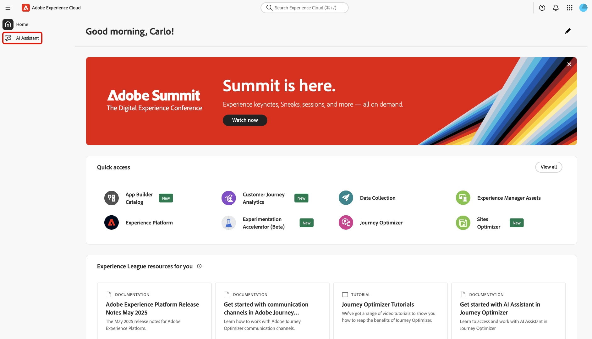
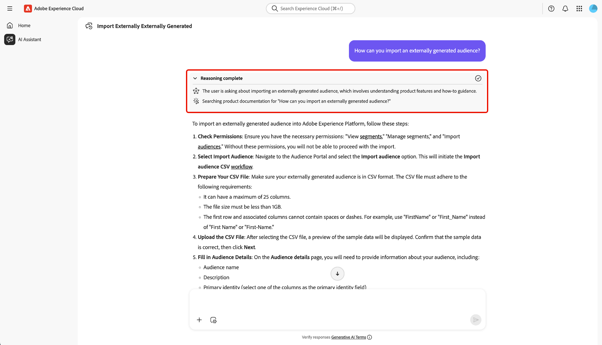
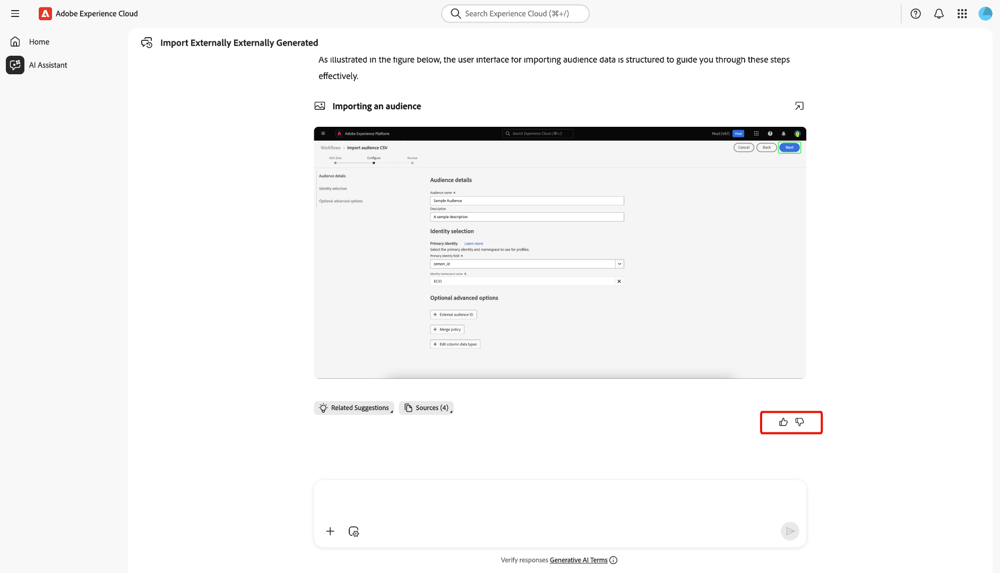
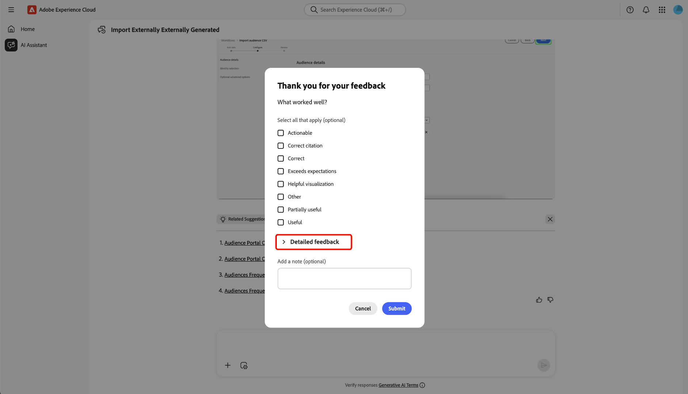
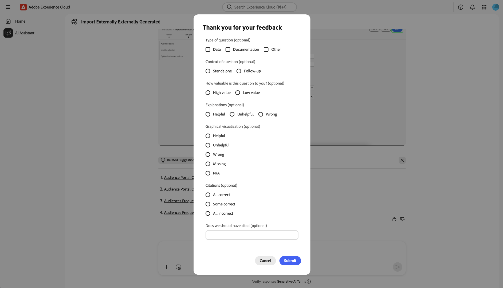

# KI-Assistent

AI Assistant ist ein interaktives, generatives KI-Tool, das die Produktivität steigert und die Arbeit in Adobe Experience Platform-basierten Anwendungen neu definiert. Sie können den KI-Assistenten verwenden, um auf Adobe Experience Platform-Agenten und andere KI-Funktionen zuzugreifen.

Lesen Sie dieses Handbuch, um zu erfahren, wie Sie den KI-Assistenten verwenden können.

## Zugriff auf den KI-Assistenten

Es gibt mehrere Möglichkeiten, auf den KI-Assistenten zuzugreifen.

Wählen Sie auf der Experience Cloud-Startseite **[!UICONTROL KI-Assistent]** aus der linken Navigationsleiste, um die Vollbildansicht des KI-Assistenten zu öffnen.

+++Zum Anzeigen auswählen

+++

Sie können den KI-Assistenten auch über die Startseiten von Experience Cloud-Programmen wie Experience Platform, Adobe Journey Optimizer und Customer Journey Analytics starten. Navigieren Sie zu Ihrer Produkt-Startseite und wählen Sie dann in der oberen **das Symbol** KI-Assistent“ aus, um das Chat-Bedienfeld des KI-Assistenten in der rechten Leiste zu starten.

+++Zum Anzeigen auswählen

+++

## Navigieren in der Benutzeroberfläche des KI-Assistenten

In diesem Abschnitt erfahren Sie, wie Sie in der Benutzeroberfläche des KI-Assistenten navigieren können.

### Vollbildansicht

Die Benutzeroberfläche des KI-Assistenten umfasst mehrere wichtige Elemente, die Ihnen bei der effektiven Interaktion helfen:

1. **[!UICONTROL Unterhaltungen]**: Wählen Sie das Symbol **[!UICONTROL Unterhaltungen]** aus, um eine neue Unterhaltung zu beginnen und auf aktuelle Unterhaltungen aus Ihrem Verlauf zuzugreifen. Weitere Informationen finden Sie im Abschnitt zu [Konversationen](#conversations).
2. **Eingabefeld**: Wählen Sie das Eingabefeld aus, um Fragen und Eingabeaufforderungen für den KI-Assistenten einzugeben. Weitere Informationen finden Sie im Abschnitt zu [Eingabefunktionen](#input-features).
3. **Daten und Objekt automatisch vervollständigen**: - Wählen Sie das Pluszeichen, um Daten- und Objektvorschläge zu verwenden und die automatische Vervollständigung durchzuführen. Wenn ausgewählt, können Sie ein Popup-Fenster verwenden, um vorgeschlagene Entitäten auszuwählen. Weitere Informationen finden Sie im Abschnitt zu [automatische Vervollständigung von Daten und Objekten](#autocomplete).
4. **Kontexteinstellung**: Wählen Sie das Symbol Kontexteinstellung aus, um Informationsquellen für den KI-Assistenten zu konfigurieren. Sie können dieses Tool verwenden, um die Anwendung, Sandbox und Datenansicht zu konfigurieren, auf die der KI-Assistent verweist, um Ihre Abfrage zu beantworten. Weitere Informationen finden Sie im Abschnitt zu [Kontexteinstellungen](#context-setting).
5. **Discovery**: Wählen Sie **[!UICONTROL Lernen]**, **[!UICONTROL Analysieren]** und **[!UICONTROL Optimieren]**, um Beispielabfragen anzuzeigen, mit denen Sie beginnen können. Weitere Informationen finden Sie im Abschnitt zu [Entdeckungsaufforderungen](#discoverability-prompts).

### Leistenansicht

Die Leistenansicht bietet schnellen Zugriff auf Chat, Erkennungsaufforderungen, Aktualisierungen, Unterhaltungen und Benutzeroberflächen-Steuerelemente in einem kompakten Bedienfeld.

1. **[!UICONTROL Chat]**: Wählen Sie **[!UICONTROL Chat]** in der Kopfzeile aus, um zu Ihrer Konversation zurückzukehren, falls Sie sie verlassen haben, um auf verschiedene Elemente in der Benutzeroberfläche zuzugreifen.
1. **[!UICONTROL Discovery]**: Wählen Sie **[!UICONTROL Discovery]** aus, um eine Liste der Eingabeaufforderungen des KI-Assistenten nach Kategorie geordnet anzuzeigen. Sie können diese vorkonfigurierten Eingabeaufforderungen verwenden, um Ihren Chat zu füllen. Darüber hinaus können Sie die vorgeschlagenen Eingabeaufforderungen an Ihren jeweiligen Anwendungsfall anpassen.
1. **[!UICONTROL Neue Funktionen]** Wählen Sie **[!UICONTROL Neue Funktionen]** aus, um eine Liste der neuesten Aktualisierungen anzuzeigen, die für den KI-Assistenten verfügbar sind.
1. **[!UICONTROL Unterhaltungen]**: Wählen Sie das Symbol **[!UICONTROL Unterhaltungen]** aus, um eine neue Unterhaltung zu beginnen und auf aktuelle Unterhaltungen aus Ihrem Verlauf zuzugreifen. Weitere Informationen finden Sie im Abschnitt zu [Konversationen](#conversations).
1. **Vollbildansicht**: Wählen Sie das Symbol **[!UICONTROL Vollbildansicht]** aus, um Ihre Benutzeroberfläche des KI-Assistenten von der rechten Leiste in den Vollbildmodus zu ändern.
1. **Automatische Vervollständigung von Daten und Objekten**: Wählen Sie das Pluszeichen, um Daten- und Objektvorschläge zu verwenden und die automatische Vervollständigung durchzuführen. Wenn ausgewählt, können Sie ein Popup-Fenster verwenden, um vorgeschlagene Entitäten auszuwählen. Weitere Informationen finden Sie im Abschnitt zu [automatische Vervollständigung von Daten und Objekten](#autocomplete).
1. **Kontexteinstellung**: Wählen Sie das Symbol Kontexteinstellung aus, um Informationsquellen für den KI-Assistenten zu konfigurieren. Sie können dieses Tool verwenden, um die Anwendung, Sandbox und Datenansicht zu konfigurieren, auf die der KI-Assistent verweist, um Ihre Abfrage zu beantworten. Weitere Informationen finden Sie im Abschnitt zu [Kontexteinstellungen](#context-setting).

## Handbuch zur Benutzeroberfläche des KI-Assistenten

Dieser Abschnitt bietet einen Überblick über die wichtigsten Funktionen und Navigationsoptionen in der Benutzeroberfläche des KI-Assistenten. Es wird erläutert, wie auf den KI-Assistenten zugegriffen wird, das Layout und die Steuerelemente sowohl in der Vollbild- als auch in der Leistenansicht beschrieben werden und es werden wichtige Tools wie Unterhaltungen, Eingabefunktionen, automatische Vervollständigung, Kontexteinstellungen und Erkennungsaufforderungen vorgestellt. Die folgenden Abschnitte enthalten detaillierte Anleitungen zur Verwendung dieser Funktionen, um mit dem KI-Assistenten zu interagieren und Ihre Erfahrung optimal zu nutzen.

### Erkennungsaufforderungen

Mit der Erkennungsfunktion des KI-Assistenten können Sie eine Liste der allgemeinen Themen anzeigen, die von dem KI-Assistenten unterstützt werden, gruppiert in Entitäten. Die Erkennungsaufforderungen unterscheiden sich je nach Ausgangspunkt.

>[!BEGINTABS]

>[!TAB Verwenden der Erkennung in der Vollbildansicht]

Im Vollbildmodus sind Erkennungsaufforderungen in drei Kategorien unterteilt: **[!UICONTROL Lernen]**, **[!UICONTROL Analysieren]** und **[!UICONTROL Optimieren]**.

Um die Erkennungsaufforderungen zum Erweitern des Produktwissens zu verwenden, wählen Sie **[!UICONTROL Lernen]** und dann im angezeigten Dropdown-Fenster eine Eingabeaufforderung aus.

>[!TAB Verwenden Sie Discover in der Leistenansicht]

Wählen Sie **[!UICONTROL Discovery]** in der Leistenansicht aus, um auf eine umfassende Liste von Erkennungsaufforderungen zuzugreifen, die Sie verwenden können, um zu beginnen und Ihren Chat mit dem KI-Assistenten zu füllen.

>[!ENDTABS]

Wählen Sie eine Eingabeaufforderung aus, um das Eingabefeld zu füllen. Von hier aus können Sie die Eingabeaufforderung entsprechend Ihrem jeweiligen Anwendungsfall bearbeiten. Wenn Sie bereit sind, klicken Sie auf das Symbol Senden rechts, um Ihre Abfrage zu senden.

## Interagieren mit Antworten

### Auf Logik prüfen {#reasoning}

Der KI-Assistent fragt dann seine Wissensdatenbank ab und berechnet eine Antwort. Nach einigen Augenblicken gibt der KI-Assistent eine Antwort zurück, einschließlich Optionen, um tiefer in den Argumentationsprozess, zugehörige Vorschläge, Informationsquellen und Feedback-Tools einzutauchen.

Um den zugrunde liegenden Argumentationsprozess besser zu verstehen, wählen Sie **[!UICONTROL Argumentation abgeschlossen]** aus.

Das *[!UICONTROL Reasoning complete]* wird erweitert und zeigt eine Zusammenfassung Ihrer Anfrage und Details zur Erstellung der Antwort an.

### Verwandte Vorschläge verwenden

Navigieren Sie dann nach unten zum Ende der Antwort und wählen Sie **[!UICONTROL Verknüpfte Vorschläge]** aus, um eine Liste mit Eingabeaufforderungen bezüglich Ihrer ursprünglichen Abfrage zu erhalten. Sie können diese Eingabeaufforderungen verwenden, um Ihr Gespräch mit dem KI-Assistenten fortzusetzen.

### Quellen anzeigen

Um die Antwort des KI-Assistenten zu überprüfen, wählen Sie **[!UICONTROL Quellen]** aus, um eine Liste der Informationsquellen anzuzeigen, auf die der KI-Assistent bei der Berechnung seiner Antwort verwiesen hat.

### Feedback geben

Mithilfe der mit der Antwort bereitgestellten Optionen können Sie Feedback zu Ihren Erfahrungen mit dem KI-Assistenten geben.

Um Feedback zu geben, wählen Sie entweder Daumen hoch oder Daumen runter aus, nachdem Sie eine Antwort vom KI-Assistenten erhalten haben, und geben Sie dann Ihr Feedback in das bereitgestellte Textfeld ein.

>[!BEGINTABS]

>[!TAB Daumen hoch]

Wählen Sie **[!UICONTROL Daumen hoch]**, um positives Feedback zu geben. Sie können optional aus einer Liste mit positivem Feedback auswählen oder das Eingabefeld verwenden, um Ihr eigenes spezifisches Feedback einzugeben.

+++Zum Anzeigen auswählen

Sie können auch **[!UICONTROL Detailliertes Feedback]** auswählen, um Ihr Feedback weiter auszuarbeiten. Wenn Sie fertig sind, klicken Sie auf **[!UICONTROL Absenden]**..

+++

>[!TAB Daumen runter]

Wählen Sie **[!UICONTROL Daumen runter]** um konstruktives Feedback zu geben. Sie können optional aus einer Liste mit konstruktivem Feedback auswählen oder das Eingabefeld verwenden, um Ihr eigenes spezifisches Feedback einzugeben.

+++Zum Anzeigen auswählen

Ebenso können Sie auch **[!UICONTROL Detailliertes Feedback]** auswählen, um Ihr Feedback weiter auszuarbeiten. Wenn Sie fertig sind, klicken Sie auf **[!UICONTROL Absenden]**..

+++

>[!ENDTABS]

### Verwenden der Funktion „Aufspaltungsansicht“

Wenn die Antwort des KI-Assistenten ein Bild enthält, können Sie das Pfadsymbol auswählen, um einen Aufspaltungsmodus zu starten. Auf diese Weise können Sie die gesamte Antwort des KI-Assistenten mit dem kontextuellen Bild, das auf der rechten Seite angezeigt wird, lesen.

### Unterhaltungen

Sie können das Bedienfeld *[!UICONTROL Alle Konversationen]* verwenden, um Konversationen mit dem KI-Assistenten zurückzusetzen und erneut aufzurufen. Wählen Sie das Symbol **[!UICONTROL Konversationen]** aus, um das Fenster *[!UICONTROL Alle Konversationen]* anzuzeigen.

Um eine frühere Konversation erneut aufzurufen, wählen Sie das Konversationsthema aus der bereitgestellten Liste aus.

Um eine neue Unterhaltung zu beginnen, wählen Sie **[!UICONTROL Neue Unterhaltung]** aus.

### Kontexteinstellung {#context-setting}

Verwenden Sie die Kontexteinstellungsfunktion des KI-Assistenten, um die **Anwendung**, **Sandbox** und **Datenansicht** zu konfigurieren, auf die der KI-Assistent zur Beantwortung Ihrer Abfrage verweist. Um auf die Kontexteinstellung zuzugreifen, wählen Sie **[!UICONTROL Symbol „Kontexteinstellung]** aus dem Eingabefeld aus.

Das *[!UICONTROL Antwort von…]* Popup-Fenster wird angezeigt. Verwenden Sie dieses Fenster, um die Informationsquellen zu konfigurieren, die Sie verwenden möchten, und wählen Sie dann **[!UICONTROL Kontext festlegen]**.

| Informationsquelle | Beschreibung | Beispiele |
| --- | --- | --- |
| App | Die Experience Cloud-Anwendung, zu der Ihre Abfrage gehört. | Experience Platform, Journey Optimizer, Customer Journey Analytics usw. |
| Sandbox | Die Sandbox, die die Datensätze oder Informationen enthält, auf die sich Ihre Abfrage bezieht. | Prod (VA7), Dev. |
| Datenansicht | Wenn Sie den KI-Assistenten mit Customer Journey Analytics verwenden, hilft Ihnen die Datenansichtseinstellung beim Verständnis von Data Insights Agent: <ul><li>Zu abfragende Datensätze</li><li>Welche Datenkomponenten verfügbar sind</li><li>Strukturieren von Antworten auf Ihre Daten</li><li>Welche Visualisierungen in Analysis Workspace erstellt werden sollen</li></ul> |

### Daten und Objekt automatisch vervollständigen

Sie können die Funktion zur automatischen Vervollständigung verwenden, um eine Liste von Datenobjekten zu erhalten, die in Ihrer Sandbox vorhanden sind. Um die automatische Vervollständigung zu verwenden, geben Sie in Ihrer Abfrage das Pluszeichen (+) ein. Alternativ können Sie auch das Pluszeichen (+) unten im Texteingabefeld auswählen. Es wird ein Fenster mit einer Liste empfohlener Datenobjekte aus Ihrer Sandbox angezeigt.

### Überprüfen von Antworten

Es gibt eine Reihe von Möglichkeiten, Antworten des KI-Assistenten zu überprüfen. Wählen Sie **[!UICONTROL Abfragebegriff, der mit Objekten]** wurde) aus, um eine Zusammenfassung der Begriffe in Ihrer Abfrage anzuzeigen, die mit bestimmten Objekten in Ihrer Organisation abgeglichen wurden.

Wählen Sie **[!UICONTROL Hier habe ich die Ergebnisse erhalten]** um eine detaillierte, schrittweise Erklärung zu erhalten, wie der KI-Assistent zu seiner Antwort gelangt ist. Darüber hinaus können Sie auch die SQL-Abfrage anzeigen, die zur Beantwortung Ihrer Frage ausgeführt wurde. Diese Abfrage ist schreibgeschützt und wird für die Verwendung im Abfrage-Service nicht unterstützt.

### Konfigurieren der Datenvisualisierung

Sie können die Datenvisualisierungsfunktionen des KI-Assistenten verwenden, um Ihre Daten besser zu verstehen. Sie können auch den Diagrammtyp angeben, den Sie in Ihrer Abfrage verwenden möchten. Senden Sie beispielsweise eine Abfrage mit folgendem Inhalt: **Nach Produktname für letzten Monat (Balken) Gewinn anzeigen“**, um ein Balkendiagramm für den Gewinn im letzten Monat zu erhalten, sortiert nach Produktname.

Wählen Sie anschließend **[!UICONTROL Eigenschaften]**, um den Diagrammtyp zu ändern und Werte für Ihre X- und Y-Achse zu konfigurieren.

Der KI-Assistent unterstützt verschiedene Diagrammtypen für die Datenvisualisierung. Sie können mit allen Diagrammtypen interagieren, indem Sie den Mauszeiger über die Daten bewegen.

>[!BEGINTABS]

>[!TAB Line]

Um ein Liniendiagramm anzuzeigen, wählen Sie **[!UICONTROL Eigenschaften]** und anschließend **[!UICONTROL Linie]** aus.

>[!TAB Bereich]

Um ein Flächendiagramm anzuzeigen, wählen Sie **[!UICONTROL Eigenschaften]** und dann **[!UICONTROL Bereich]** aus.

>[!TAB Streuung]

Um ein Streudiagramm anzuzeigen, wählen Sie **[!UICONTROL Eigenschaften]** und dann **[!UICONTROL Streudiagramm]** aus.

>[!TAB Ringdiagramm]

Um ein Ringdiagramm anzuzeigen, wählen Sie **[!UICONTROL Eigenschaften]** und dann **[!UICONTROL Ringdiagramm]** aus.

>[!ENDTABS]
